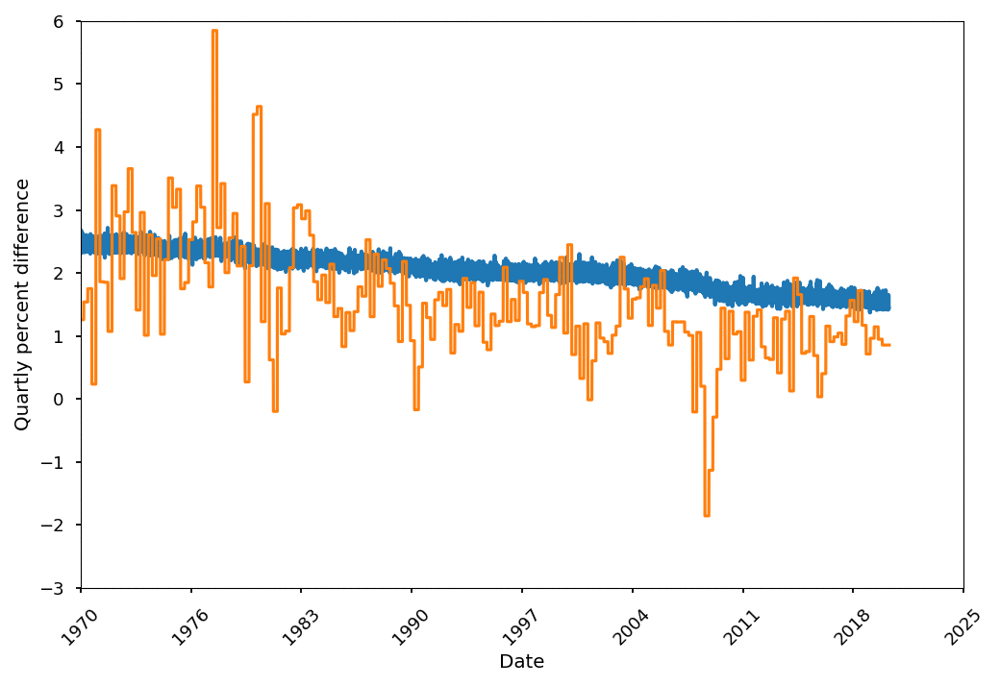

## GDP predictor Front-End  

### Under Development 

Should the FED increase or decrease the inflation rate given the current
economic state?

This is a fun project that attempts to answer that question. 
A mixture of synthetic GDP data produced by a conditional generator and real
GDP data based on the economic state trained a soft actor-critic
deep reenforcement learning algorithim to recommend increaseing or decreasing
the interest rate.   

The conditional GAN was trained with 9 macroeconomic indicators using a LSTM
with a PATCHGAN type framework to estimate the latent state.  

Macroeconomic indicator data are pulled from the St. Lous FRED, cleaned, processed
(Normalized to -1-1 interval) and run through the relevent pytorch models on a
flask backend server. A GET request pulls the data 

```
    https://serene-crag-25078.herokuapp.com/api/predict
```




Training progress of the CGAN on the percent difference of the GDP.
The model takes 9 macroeconomic indicators and generates a prediction of the
GDP.

More info will be included in the frontend. 
